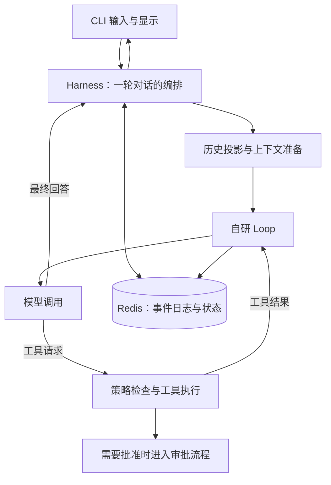

# Go-AI-Gateway

**一个以 CLI 为主要入口、用 Go 构建的 Agent Harness。**

连接兼容 OpenAI Chat Completions 的模型，在终端中进行多轮对话、读取项目源码、调用工具，并由 Harness 管理历史、审批、取消和执行记录。核心 Agent 循环自行实现，Eino 用于模型适配和工具接口。

项目从 IM 网关演进而来，保留了原有名称和服务端代码。目前专注于 **CLI 的实际使用，以及可追溯、可度量的上下文管理**。适合学习 Agent 工程、研究执行链路，或作为个人 Harness 的开发起点。

[快速开始](#快速开始) · [CLI 文档](docs/cli.md) · [测试说明](test/README.md) · [上下文基线](test/contextbaseline/README.md)

## 当前能力

| 能力 | 已有实现 |
|---|---|
| 终端对话 | 流式回答、工具进度汇总、显式多行粘贴、取消；可显示服务商返回的推理字段 |
| 只读项目工具 | `list_files`、`read_file`、`search_files`，限定工作目录，返回行号、分页和截断信息 |
| 自研执行循环 | 模型 → 工具 → 模型；逐步记录事件，处理错误、步数上限和共享重试预算 |
| 历史与大内容 | Redis 事件日志、历史投影、摘要压缩、折叠水位、大工具结果外存与回读 |
| 审批与执行 | 待审批提案、确认码、原子领取和执行记录；本机或 Docker 执行后端 |
| 扩展与委派 | MCP 工具接入、子任务委派、独立子运行日志与归属关联 |
| 输入与用量观测 | 输入组成估算，主调用、子调用、摘要及重试的 SDK 用量统计 |
| 来源定位基础 | 用户 + 日志代次 + 原始 seq 的来源 ID，Unicode 正文分页；目前为存储接口 |

工作区工具只读，不提供通用的源码修改或命令执行工具。内置审批动作、MCP 工具拥有各自的执行边界，不能把“文件工具只读”理解为整个进程都没有写入能力。

## 快速开始

需要 **Go 1.25.5 或更高版本**（以 [go.mod](go.mod) 为准）、Redis，以及支持 Chat Completions 和工具调用的模型服务。Docker 用于快速启动 Redis，也可以连接已有 Redis。

CLI 不需要 MySQL、RabbitMQ、HTTP 服务或 JWT 配置。

### 1. 启动 Redis

在仓库根目录执行：

```bash
docker compose up -d redis
```

默认连接 `localhost:6379`。仓库的 Compose 配置用于本地开发，Redis 服务未挂载持久卷；如需长期保留对话，请另行配置 Redis 持久化及备份。

### 2. 配置模型

首次使用且尚无 `.env` 时，复制配置模板：

```bash
cp .env.example .env
```

PowerShell 可使用 `Copy-Item .env.example .env`。已有配置时直接编辑，不要覆盖。

在 `.env` 中填写：

```dotenv
VOLC_ACCESS_KEY=你的API密钥
VOLC_ENDPOINT_ID=你的模型名或推理接入点ID
VOLC_BASE_URL=你的服务商Chat-Completions基础地址
REDIS_ADDR=localhost:6379
```

`VOLC_` 是沿用的历史变量名前缀，也用于其它兼容服务。`VOLC_BASE_URL` 填基础地址，不附加 `/chat/completions`；留空使用代码默认的火山方舟地址。CLI 可保留模板中的 `JWT_SECRET` 为空，API 服务则必须配置。

环境变量优先于 `.env`，配置文件从进程当前目录加载。服务商支持的模型、工具调用和推理字段可能不同，并非所有兼容端点都有相同行为。完整选项见 [.env.example](.env.example)。

### 3. 启动 CLI

WSL / Git Bash：

```bash
bash scripts/run-agent.sh -user 1 -workspace .
```

PowerShell：

```powershell
go build -o bin/gwagent.exe ./cmd/agent
.\bin\gwagent.exe -user 1 -workspace .
```

脚本先构建到固定路径，再启动程序。`-workspace` 指定模型可以读取的目录，例如另一个项目的路径；它不改变 `.env` 的加载位置。

可以先问：

```text
读取 README.md，用不超过200字介绍这个项目，并附上来源行号。
```

`-user` 默认是 `1`，同一 ID 复用该用户的 Redis 历史。它是本地存储身份，不是登录认证；同一 ID 不应被多个 CLI/API 进程并发使用。

### 常用操作

| 输入 | 行为 |
|---|---|
| 普通文本 + 回车 | 提交一轮对话 |
| `/help`、`/exit` | 查看帮助、退出 |
| `/paste` | 开始收集多行；单独一行 `/send` 提交，`/cancel` 丢弃 |
| `/reasoning on`、`/reasoning off` | 控制服务商推理字段的显示，不改变模型推理配置或计费 |
| `auth:approve` | 查看待审批动作和确认码 |
| `auth:approve <确认码>`、`auth:reject` | 确认或拒绝动作 |
| `auth:status <提案ID>` | 查询执行记录 |
| Ctrl+C | 运行中请求取消，空闲时退出 |

普通模式按行提交。自动识别多行粘贴、输入历史编辑和 Markdown 渲染尚未实现。更多参数、文件访问限制和终端验收边界见 [CLI 文档](docs/cli.md)。

## Harness 如何工作



**turn** 是用户发起的一轮交互；**step** 是这一轮中的一次模型调用，可以包含多个工具调用。默认每轮最多 20 个 step，可通过 `AGENT_MAX_STEPS` 调整；触及上限会报告未完成。

Harness 负责一轮对话的准备、控制和收尾，Loop 负责轮内模型与工具的往返。CLI 直接复用现有 Harness，没有第二套执行循环。事件日志保存执行记录，提供给模型的历史则是日志的投影，两者并不等同。

## 正在建设：上下文管理与检索

目标是：**即使没有跨轮缓存命中，也能控制每轮输入，并尽量保留用户约束、最新决定和任务连续性。** 连续对话和隔一段时间再聊，都需要验证。

当前已有输入观测、固定场景采集和来源定位的存储基础。下一步是相邻消息与外存回读、带来源的历史检索，以及按预算选择上下文。默认对话仍使用现有历史投影和压缩，尚未切换到“只注入相关摘要与来源 ID”的策略。

| 阶段 | 状态 |
|---|---|
| 输入与调用用量观测 | 已实现；缓存字段与实际费用仍未知 |
| 固定真实模型基线 | 已采集四个开发场景；执行成功不等于回答质量达标 |
| 稳定来源 ID / 正文分页 | 存储层已实现并通过回归，尚未接入模型工具 |
| 相邻消息、外存完整回读、最小检索 | 待继续实现 |
| 有预算的上下文组装 | 待实现并进行质量、总输入和调用次数对照 |
| 自动记忆提取与向量检索 | 后置，不作为当前前置依赖 |

基线已经暴露回答长度、分页表述和评测背景供给的问题。短对话还有较大的系统提示与工具定义开销，单纯缩短历史不等于整个任务更便宜。当前不宣称已经实现固定比例的节省，详见 [基线流程与评审](test/contextbaseline/README.md)。

## 验证与测试

**2026-09-23 验证记录：** WSL 中 `HistorySource` 定向 2 项、带 `knowledgeintegration` 的全量回归 **201 项通过，0 跳过**。这是当前开发代码的验证记录，不代表任意模型和真实任务都已通过质量验收。

普通回归使用假模型和真实 Redis，不消耗真实模型 token；带 `knowledgeintegration` 的测试还需要 MySQL。缺少依赖可能跳过用例，应同时检查通过数和跳过数。

```bash
# 在 WSL 中执行，先准备测试依赖
docker compose up -d redis mysql

# 定向与全量回归
bash scripts/test-fast.sh -run HistorySource
bash scripts/test-fast.sh -tags knowledgeintegration
```

静态检查：

```bash
go vet -tags 'knowledgeintegration rageval contexteval' ./...
```

真实模型基线是单独的显式操作，会产生模型调用费用：

```bash
bash scripts/context-baseline.sh --real reading-dev
```

报告记录回答、输入估算、SDK 用量和工具元数据。`PASS` 仅表示采集正常结束；质量需逐项核对，缺失的缓存/费用数据不能记作零。详见 [测试索引](test/README.md)、[来源回读契约](test/history-source.md) 和 [基线采集说明](test/contextbaseline/README.md)。

本项目的 Windows 开发环境受端点防护限制：测试在 WSL 执行，Windows 侧使用静态检查及固定路径构建，不使用 `go run`。

## 使用边界

- **文件访问有范围，仍需选择合适的工作目录。** 工具拒绝目录穿越和符号链接，排除常见敏感路径；这些规则不能识别普通源码中的所有秘密，也不是进程级沙箱。
- **默认本机执行没有隔离。** `SANDBOX_BACKEND=local` 为宿主机直跑；Docker 后端和 `REQUIRE_SANDBOX_ISOLATION` 用于需要隔离的审批动作。
- **日志与恢复不保证外部副作用恰好执行一次。** 中断、超时及未知执行结果需要保留并核对，不能仅凭模型回答判断动作成功。
- **记住内容不等于回答可靠。** 来源、回答长度和任务理解仍需检验；真实终端取消、窗口尺寸及粘贴体验也有待持续验证。

## 代码导航

| 路径 | 职责 |
|---|---|
| [cmd/agent](cmd/agent) / [internal/cli](internal/cli) | CLI 装配、交互与显示 |
| [internal/harness](internal/harness) | 对话编排、控制、恢复与审批入口 |
| [internal/harness/agent](internal/harness/agent) | 自研 Loop、模型适配、工具装配与用量观测 |
| [internal/harness/session](internal/harness/session) | 事件日志、历史投影、压缩与来源定位 |
| [internal/harness/spill](internal/harness/spill) | 大内容外存 |
| [internal/workspace](internal/workspace) | 只读项目文件工具 |
| [test](test) / [scripts](scripts) | 回归、基线采集和启动脚本 |
| [cmd/api](cmd/api) / [internal/knowledge](internal/knowledge) | 保留的服务端与知识工作台代码 |

Web、资料管理及知识库 RAG 相关代码保留，当前暂停扩展；其 MySQL 会话和资料工具没有自动接入 CLI。当前路线是先把 CLI Harness 的上下文管理和检索做好，再依据实际使用效果决定扩展方向。
